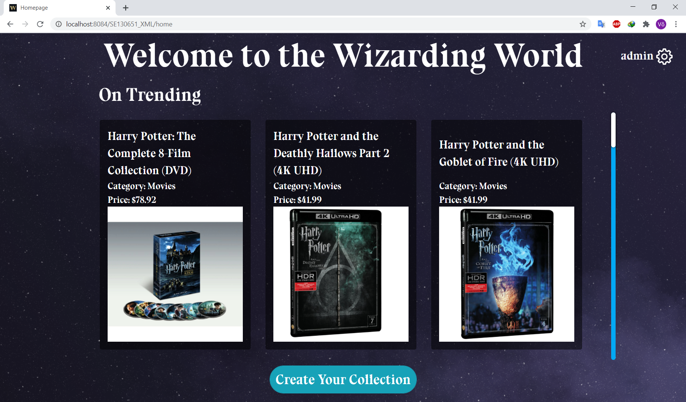

# [WIZARDING WORLD](https://github.com/truongvlit/wizarding_world) - FPT University PRX301 Project

# Java Web Application

# Description
1. Scrape data from 2 websites selling things appearing in the Harry Potter series.
2. Validate, categorize, store scraped data to the database.
3. Create a website for users to look for the items which they want and add to their collection or answer the questions to get the most suitable items for them.

# Screenshots
## 1. Authentication

## 2. Home

## 3. Collection
**Choose One Option**

**Show All Collection**

**Go To Survey**

**Survey Result**
